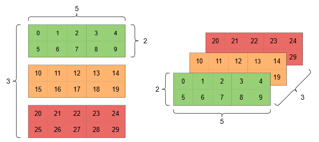
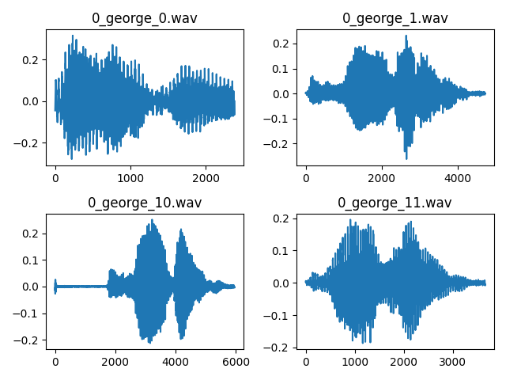
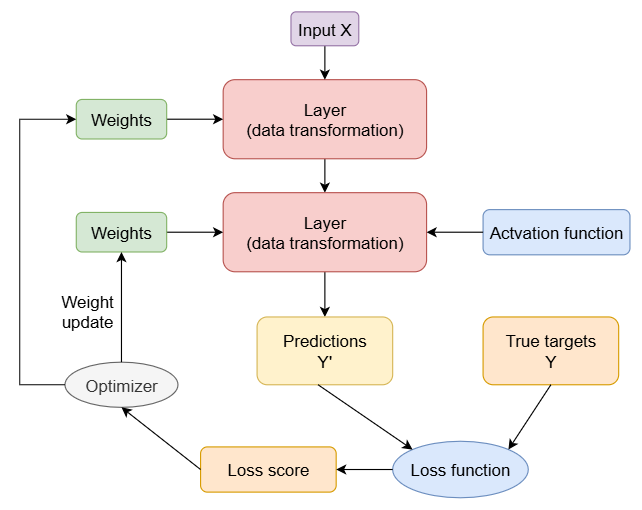
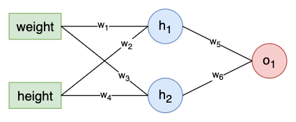
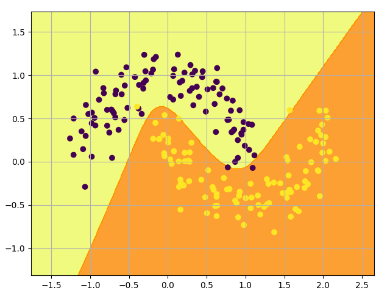
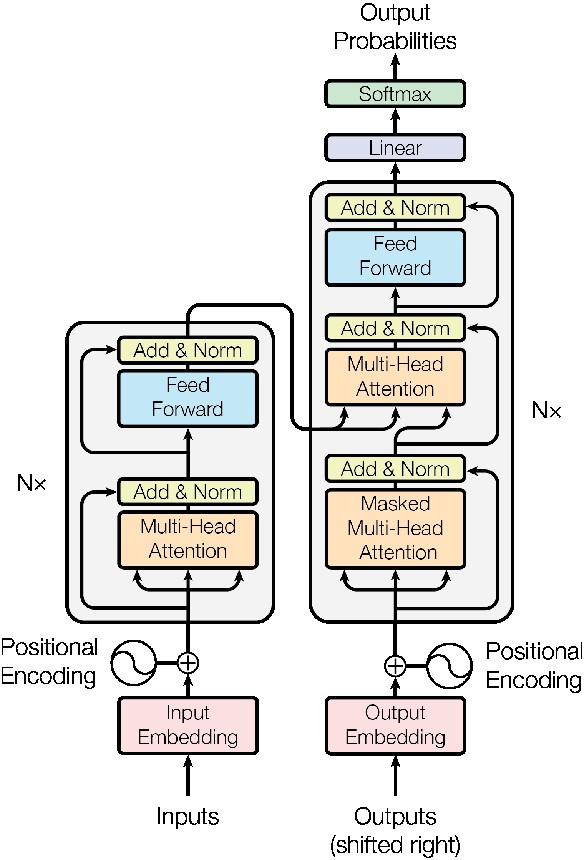
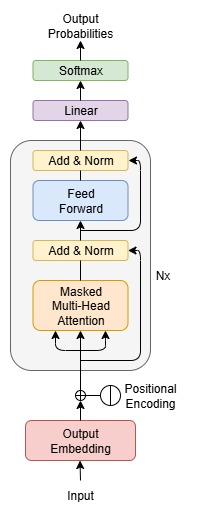
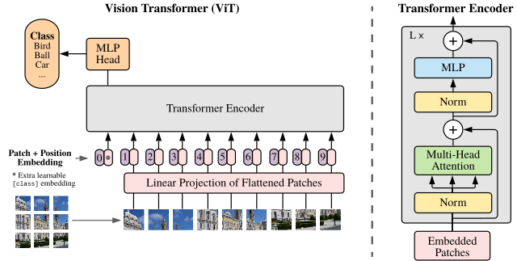

# Deep Learning with PyTorch

This [eBook](https://artinte.github.io/deep-learning/) not only focuses on the explanation of theoretical knowledge, but also pays more attention to engineering practice. By combining a large number of practical cases, especially how to train, optimize and deploy models, readers will be able to master how to use [PyTorch](https://pytorch.org/) to complete various deep learning tasks.

The code is highly practical. For example, in the Transformer chapter, four methods are used to implement the English-German translation task described in the [paper](https://arxiv.org/abs/1706.03762) :

* Directly use the pre-trained models from transformers;
* Use [torch.nn.Transformer](https://docs.pytorch.org/docs/stable/generated/torch.nn.Transformer.html) API;
* Use [torch.nn.functional.scaled_dot_product_attention](https://docs.pytorch.org/docs/stable/generated/torch.nn.functional.scaled_dot_product_attention.html) function;
* Implement from scratch.

These four methods are progressive in hierarchy and serve as excellent learning materials. The following is the table of contents of the book:

### 01 Tensor and Gradient Basics
1.1 [Install PyTorch](https://artinte.github.io/deep-learning/pytorch_install.html)

`demo_verify.py` checks if PyTorch is installed and working correctly by verifying its version, it also determines which hardware device (GPU or CPU) is being used for computations.

```
pip3 install torch torchvision torchaudio
```

1.2 [Introduction to Tensors](https://artinte.github.io/deep-learning/tensor_intro.html)

`demo_create.py` demonstrates the fundamental ways to create and manipulate PyTorch tensors, which are the core data structures in the PyTorch framework.



`demo_indexing.py`

`demo_operate.py`


1.3 [Data Representation](https://artinte.github.io/deep-learning/data_represent.html)

`demo_features.py`

`demo_text_data.py`

`demo_audio_data.py`



`demo_image_data.py`

`demo_video_data.py`


1.4 [Principles of Deep Learning](https://artinte.github.io/deep-learning/principle_learn.html)

We will explore the fundamental principles of deep learning, including the concepts of machine learning, rules and representations, neural networks, and optimization techniques such as gradient descent.



1.5 [Calculus](https://artinte.github.io/deep-learning/calculus.html)

1.6 [Gradient Descent](https://artinte.github.io/deep-learning/gradient_descent.html)


1.7 [Neural Network from Scratch](https://artinte.github.io/deep-learning/network_scratch.html)

`demo_simple_network_numpy.py` trains a small neural network from scratch using NumPy to classify a simple dataset of people's heights and weights as either male or female.




### 02 Fully Connected Network

2.1 [Linear Algebra](https://artinte.github.io/deep-learning/linear_algebra.html)

2.2 [Points Classification](https://artinte.github.io/deep-learning/point_classify.html)

`demo_dnn_torch.py` demonstrates how to build and train a simple, two-layer neural network using PyTorch to solve a classification problem. The network is designed to classify data points generated from a "make_moons" dataset, which is a non-linear dataset.



2.3 [PyTorch Basics](https://artinte.github.io/deep-learning/pytorch_basics.html)

`demo_quick_start.py` is a complete demonstration of training a simple neural network on the MNIST dataset using PyTorch. The entire process, from data preparation to model training and evaluation, is covered.

```
model = NeuralNetwork().to(device)
criterion = torch.nn.CrossEntropyLoss()
optimizer = torch.optim.SGD(model.parameters(), lr=1e-3)

def train(dataloader, model, loss_fn, optimizer):
    model.train()
    for batch, (X, y) in enumerate(dataloader):
        X, y = X.to(device), y.to(device)
        optimizer.zero_grad()

        # compute prediction error
        pred = model(X)
        loss = loss_fn(pred, y)

        # backpropagation
        loss.backward()
        optimizer.step()
```

2.4 [Activation Function](https://artinte.github.io/deep-learning/activation_function.html)

2.5 [Loss Function](https://artinte.github.io/deep-learning/loss_function.html)

2.6 [Optimizer](https://artinte.github.io/deep-learning/optimizer.html)

### 03 Convolutional Network

3.1 [CNN from Scratch](https://artinte.github.io/deep-learning/cnn_classify_stratch.html)

`demo_cnn_scratch.py`

`demo_cnn_torch.py`

3.2 [AlexNet](https://artinte.github.io/deep-learning/alex_net.html)

3.3 [ResNet](https://artinte.github.io/deep-learning/res_net.html)

3.4 [U-Net](https://artinte.github.io/deep-learning/u_net.html)

3.5 [DenseNet](https://artinte.github.io/deep-learning/dense_net.html)

### 04 Recurrent Network

4.1 [RNN from Scratch](https://artinte.github.io/deep-learning/rnn_classify_scratch.html)

4.2 [Text Preprocessing](https://artinte.github.io/deep-learning/word_embed.html)

4.3 [Word2Vec](https://artinte.github.io/deep-learning/word2vec.html)

4.4 [Text Generation with RNN](https://artinte.github.io/deep-learning/text_generate_rnn.html)

4.5 [Neural Machine Translation](https://artinte.github.io/deep-learning/nmt_align.html)

4.6 [Attention-based NMT](https://artinte.github.io/deep-learning/attention_nmt.html)

### 05 Transformer

5.1 [Attention Mechanism](https://artinte.github.io/deep-learning/attention_mechanism.html)

`demo_query_key_value.py`

`demo_nadaraya_regression.py`

`demo_scale_dot_product_attention.py` computes scaled dot product attention on query, key and value tensors, using an optional attention mask if passed, and applying dropout if a probability greater than 0.0 is specified.

```
# Efficient implementation equivalent to the following:
def scaled_dot_product_attention(query, key, value, attn_mask=None, dropout_p=0.0,
        is_causal=False, scale=None, enable_gqa=False) -> torch.Tensor:
    L, S = query.size(-2), key.size(-2)
    scale_factor = 1 / math.sqrt(query.size(-1)) if scale is None else scale
    attn_bias = torch.zeros(L, S, dtype=query.dtype, device=query.device)
    if is_causal:
        assert attn_mask is None
        temp_mask = torch.ones(L, S, dtype=torch.bool).tril(diagonal=0)
        attn_bias.masked_fill_(temp_mask.logical_not(), float("-inf"))
        attn_bias.to(query.dtype)

    if attn_mask is not None:
        if attn_mask.dtype == torch.bool:
            attn_bias.masked_fill_(attn_mask.logical_not(), float("-inf"))
        else:
            attn_bias = attn_mask + attn_bias

    if enable_gqa:
        key = key.repeat_interleave(query.size(-3)//key.size(-3), -3)
        value = value.repeat_interleave(query.size(-3)//value.size(-3), -3)

    attn_weight = query @ key.transpose(-2, -1) * scale_factor
    attn_weight += attn_bias
    attn_weight = torch.softmax(attn_weight, dim=-1)
    attn_weight = torch.dropout(attn_weight, dropout_p, train=True)
    return attn_weight @ value
```

5.2 [Attention Is All You Need](https://artinte.github.io/deep-learning/transformer_paper.html)

The original paper [Attention Is All You Need](https://arxiv.org/abs/1706.03762), and some code snippets to help understand the paper's content. The Transformer, based solely on attention mechanisms, dispensing with recurrence and convolutions entirely.



`demo_transformers.py`

5.3 [nn.Transformer](https://artinte.github.io/deep-learning/nn_transformer.html)

`project_en_de_translate.py` handles English-German translation.

5.4 [Transformer from Stratch](https://artinte.github.io/deep-learning/transformer_stratch.html)

`demo_transformer.py` demonstrates building a machine translation system using PyTorch’s [torch.nn.Transformer](https://docs.pytorch.org/docs/stable/generated/torch.nn.Transformer.html) , a flexible implementation of the Transformer architecture. The API provides encoder–decoder layers with multi-head self-attention and feedforward networks, making it well-suited for sequence-to-sequence tasks such as translation.

`demo_sdpa.py` implements the same functionality as `demo_transformer.py` , but it rewrites the `torch.nn.Transformer` features—including the core modules like the encoder, decoder, and multi-head attention—using PyTorch's native APIs, such as [torch.nn.functional.scaled_dot_product_attention](https://docs.pytorch.org/docs/stable/generated/torch.nn.functional.scaled_dot_product_attention.html) .

`demo_scratch.py` further decompose the Transformer structure by implementing key components like residual networks and layer normalization to achieve a thorough mastery of the architecture.

5.5 [GPT](https://artinte.github.io/deep-learning/nano_gpt.html)



`project_chinese_poetry.py` defines and trains a GPT-like model to generate Chinese poetry.

`project_word_language_model.py` trains a multi-layer RNN (Elman, GRU, or LSTM) or Transformer on a language modeling task. By default, the training script uses the Wikitext-2 dataset, provided. The trained model can then be used by the script to generate new text.

5.6 [BERT](https://artinte.github.io/deep-learning/bert.html)

The `project_bert.py` code references the [google-research/bert](https://github.com/google-research/bert) project, but is implemented using PyTorch. BERT, which stands for Bidirectional Encoder Representations from Transformers, is designed to pre-train deep bidirectional representations from unlabeled text by jointly conditioning on both left and right context in all layers.

5.7 [Vision Transformer](https://artinte.github.io/deep-learning/vision_transformer.html)



`demo_mnist_classify.py`

Implementation of Vision Transformer, a simple way to achieve SOTA in vision classification with only a single transformer encoder, in Pytorch. For more information, please refer to [lucidrains/vit-pytorch](https://github.com/lucidrains/vit-pytorch) .


### 06 Diffusion Model

6.1 [Probability Theory](https://artinte.github.io/deep-learning/prob_theory.html)

6.2 [Gaussian Processes](https://artinte.github.io/deep-learning/gaussian_process.html)

6.3 [Mathematical Foundation](https://artinte.github.io/deep-learning/diffusion_math.html)

6.4 [Diffusion from Scratch](https://artinte.github.io/deep-learning/diffusion_scratch.html)

6.5 [Estimating Gradients](https://artinte.github.io/deep-learning/estimate_gradients.html)

6.6 [Diffusion Probability Model](https://artinte.github.io/deep-learning/dd_prob_model.html)

6.7 [Latent Diffusion](https://artinte.github.io/deep-learning/latent_diffusion.html)

### 07 Text

7.1 [MIDI Prediction](https://artinte.github.io/deep-learning/trans_transformer.html)

`project_midi_prediction.py` uses a Transformer Decoder to predict MIDI music. It preprocesses MIDI into event sequences, trains the model on these sequences, and generates complete MIDI files autoregressively via greedy search.

7.2 [Easy OCR](https://artinte.github.io/deep-learning/easy_ocr.html)

`project_auto_deal.py` take screenshots of the phone screen using Android ADB, and perform text recognition with the EasyOCR library.

7.3 [Language Modeling](https://artinte.github.io/deep-learning/language_model.html)

`project_gamma_finetune.py`

7.4 [Chatbots](https://artinte.github.io/deep-learning/chatbots.html)

`project_chatbots.py`


### 08 Audio

8.1 [Speech Feature Extraction](https://artinte.github.io/deep-learning/speech_feature.html)

8.2 [Automatic Speech Recognition](https://artinte.github.io/deep-learning/speech_recognition.html)

8.3 [Text-to-Speech](https://artinte.github.io/deep-learning/text_to_speech.html)

8.4 [Music Transcription](https://artinte.github.io/deep-learning/music_transcription.html)

8.5 [Music Synthesis](https://artinte.github.io/deep-learning/music_synthesis.html)

### 09 Image and Video

9.1 [Object Detection](https://artinte.github.io/deep-learning/object_detection.html)

9.2 [Transfer Learning](https://artinte.github.io/deep-learning/transfer_learning.html)

9.3 [FGSM Attack](https://artinte.github.io/deep-learning/fgsm_attack.html)

9.4 [Spatial Transformer](https://artinte.github.io/deep-learning/spatial_transformer.html)

9.5 [DeepFaceLab](https://artinte.github.io/deep-learning/deep_face_lab.html)

9.6 [DeepFaceLive](https://artinte.github.io/deep-learning/deep_face_live.html)

9.7 [Segment Anything](https://artinte.github.io/deep-learning/segment_anything.html)

9.8 [Intro to Autoencoders](https://artinte.github.io/deep-learning/intro_auto_encoder.html)

### 10 Reinforcement Learning

10.1 [Introduction RL Problems](https://artinte.github.io/deep-learning/rl_introduction.html)

10.2 [Markov Decision Processes](https://artinte.github.io/deep-learning/markov_process.html)

10.3 [Dynamic Programming](https://artinte.github.io/deep-learning/dynamic_program.html)

10.4 [DQN](https://artinte.github.io/deep-learning/dqn.html)

10.5 [PPO](https://artinte.github.io/deep-learning/ppo.html)

10.6 [Function Approximation](https://artinte.github.io/deep-learning/function_appro.html)

### 11 Extending PyTorch

11.1 [Custom Operators](https://artinte.github.io/deep-learning/custom_operator.html)

11.2 [Custom C++ and CUDA Operators](https://artinte.github.io/deep-learning/cpp_cuda_operators.html)

11.3 [Double Backward](https://artinte.github.io/deep-learning/double_backward.html)

11.4 [Fusing Conv and Batch Norm](https://artinte.github.io/deep-learning/custom_function.html)

### 12 Deploying Models

12.1 [ONNX](https://artinte.github.io/deep-learning/onnx.html)

12.2 [ExecuTorch](https://artinte.github.io/deep-learning/execu_torch.html)

12.3 [LiteRT](https://artinte.github.io/deep-learning/litert.html)

12.4 [TensorFlow.js](https://artinte.github.io/deep-learning/tensorflow_js.html)

### 13 Model Optimization

13.1 [LoRA](https://artinte.github.io/deep-learning/lora.html)

13.2 [Pruning](https://artinte.github.io/deep-learning/pruning.html)

13.3 [Quantization](https://artinte.github.io/deep-learning/quantization.html)

13.4 [Distillation](https://artinte.github.io/deep-learning/distillation.html)

### 14 Distributed Training

14.1 [Distributed Data Parallel](https://artinte.github.io/deep-learning/distrib_parallel.html)

14.2 [Fully Sharded Data Parallel](https://artinte.github.io/deep-learning/fully_parallel.html)

14.3 [Tensor Parallel](https://artinte.github.io/deep-learning/tensor_parallel.html)

14.4 [Device Mesh](https://artinte.github.io/deep-learning/device_mesh.html)

14.5 [Remote Procedure Call](https://artinte.github.io/deep-learning/remote_call.html)

### 15 Graph Netural Network

15.1 [Graph Foundation](https://artinte.github.io/deep-learning/graph_foundation.html)

15.2 [Core Ideas](https://artinte.github.io/deep-learning/core_idea.html)

15.3 [Design of GNN](https://artinte.github.io/deep-learning/design_of_gnn.html)

15.4 [Use-Cases & Applications](https://artinte.github.io/deep-learning/use_cases.html)

15.5 [Advanced Concepts](https://artinte.github.io/deep-learning/advanced_concepts.html)

### 16 Bayesian Statistics


For more information, please visit website [Deep Learing with PyTorch](https://artinte.github.io/deep-learning/index.html).
