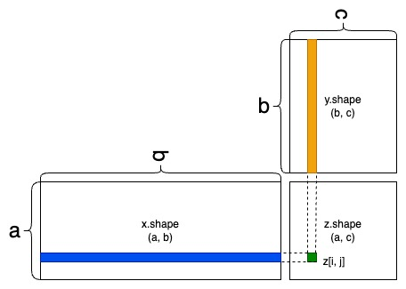
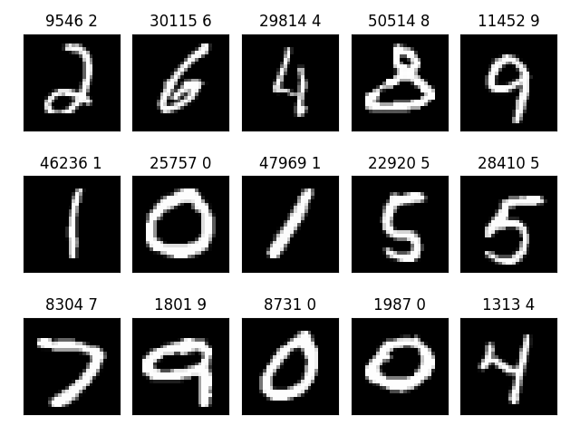
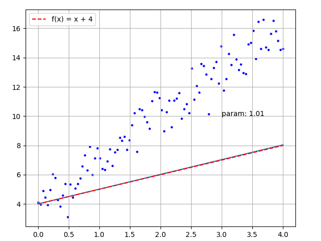
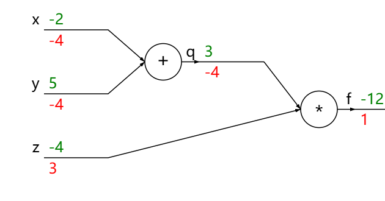
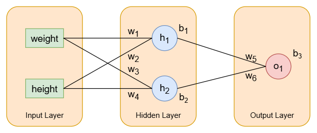
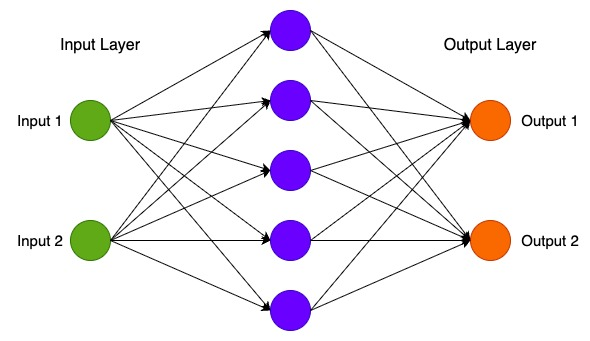
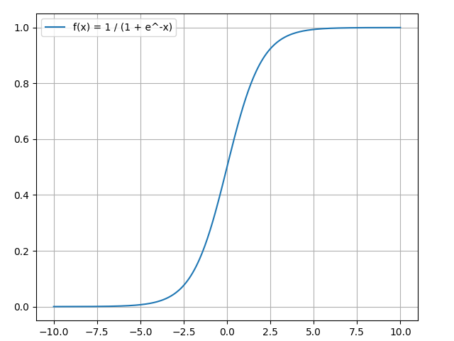
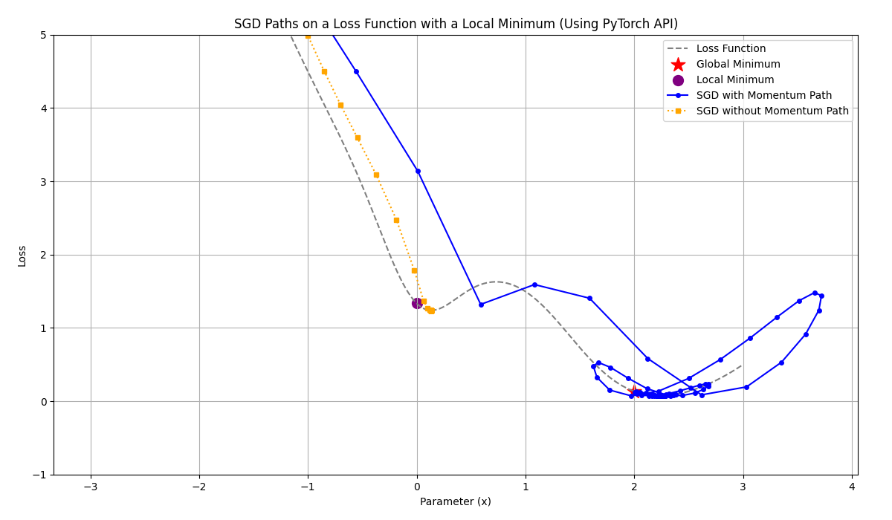
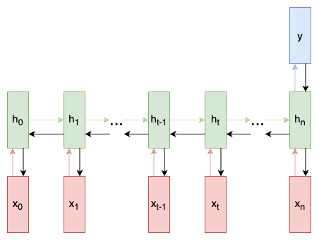

# Deep Learning with PyTorch

This [eBook](https://artinte.github.io/deep-learning/) not only focuses on the explanation of theoretical knowledge, but also pays more attention to engineering practice. By combining a large number of practical cases, especially how to train, optimize and deploy models, readers will be able to master how to use [PyTorch](https://pytorch.org/) to complete various deep learning tasks.

The code is highly practical. For example, in the Transformer chapter, four methods are used to implement the English-German translation task described in the [paper](https://arxiv.org/abs/1706.03762) :

* Directly use the pre-trained models from transformers;
* Use [torch.nn.Transformer](https://docs.pytorch.org/docs/stable/generated/torch.nn.Transformer.html) API;
* Use [torch.nn.functional.scaled_dot_product_attention](https://docs.pytorch.org/docs/stable/generated/torch.nn.functional.scaled_dot_product_attention.html) function;
* Implement from scratch.

These four methods are progressive in hierarchy and serve as excellent learning materials. The following is the table of contents of the book:

### 01 Tensor and Gradient Basics
1.1 [Install PyTorch](https://artinte.github.io/deep-learning/pytorch_install.html)

`demo_verify.py` checks if PyTorch is installed and working correctly by verifying its version, it also determines which hardware device (GPU or CPU) is being used for computations.

```
pip3 install torch torchvision torchaudio
```

In this section, we will set up all the development environments, such as the [Visual Studio Code](https://code.visualstudio.com/) , CUDA installation, Python installation, and Windows Terminal.

1.2 [Introduction to Tensors](https://artinte.github.io/deep-learning/tensor_intro.html)

`demo_create.py` demonstrates the fundamental ways to create and manipulate PyTorch tensors, which are the core data structures in the PyTorch framework.


`demo_indexing.py` demonstrates Tensor indexing and slicing in PyTorch, it's very similar to how you would use NumPy. Indexing is very important because it's seen everywhere in code.

* Basic slicing occurs when obj is a `slice` object (constructed by `start:stop:step` notation inside of brackets), an integer, or a tuple of `slice` objects and integers.

* `Ellipsis` expands to the number of `:` objects needed for the selection tuple to index all dimensions.

* Each `newaxis` object in the selection tuple serves to expand the dimensions of the resulting selection by one unit-length dimension.

The torch package contains data structures for multi-dimensional tensors and defines mathematical operations over these tensors. Additionally, it provides many utilities for efficient serialization of Tensors and arbitrary types, and other useful utilities. The `demo_operate.py` file contains just a few key examples; you can refer to the [PyTorch API](https://docs.pytorch.org/docs/stable/torch.html) for more.

`demo_dot_product.py` demonstrates dot product operations on tensors by implementing them using basic Python loops, then confirming the results with PyTorch's optimized `torch.matmul()` function. It's a clear illustration of what matrix multiplication and related operations do under the hood.



```
def naive_vector_dot(vector_a, vector_b):
    assert len(vector_a.shape) == 1
    assert len(vector_b.shape) == 1
    assert vector_a.shape[0] == vector_b.shape[0]
    z = 0.0
    for i in range(vector_a.shape[0]):
        z += vector_a[i] * vector_b[i]
    return z
```


1.3 [Data Representation](https://artinte.github.io/deep-learning/data_represent.html)

In machine learning and pattern recognition, a feature is an individual measurable property or characteristic of a data set. `demo_features.py` generates and visualizes a simple linear regression dataset. It creates a set of noisy data points that follow a linear trend and then plots both the data and the underlying true linear function.

`demo_text_data.py` downloads, extracts, and explores a dataset of movie reviews for sentiment analysis. In machine learning, text must be converted into numerical data for computation. We'll learn how to use tokenization for this process later.

`demo_audio_data.py` analyzes and visualizes audio data, specifically focusing on spoken digits.


`demo_image_data.py` uses [matplotlib](https://matplotlib.org/) to visualize images from the MNIST dataset, a common dataset of handwritten digits. This is a dataset of 60,000 28x28 grayscale images of the 10 digits, along with a test set of 10,000 images.



```
def mnist_read(images_path, labels_path):
    labels = []
    with open(labels_path, 'rb') as file:
        magic, size = struct.unpack('>II', file.read(8))
        if magic != 2049:
            raise ValueError('Magic number mismatch, got {}'.format(magic))
        labels = array.array('B', file.read())

    with open(images_path, 'rb') as file:
        magic, size, rows, cols = struct.unpack('>IIII', file.read(16))
        if magic != 2051:
            raise ValueError('Magic number mismatch, got {}'.format(magic))
        image_data = array.array('B', file.read())

    images = []
    for k in range(size):
        images.append([0] * rows * cols)
    for j in range(size):
        img = numpy.array(image_data[j * rows * cols:(j + 1) * rows * cols])
        img = img.reshape(28, 28)
        images[j][:] = img

    return numpy.array(images), numpy.array(labels)
```


1.4 [Principles of Deep Learning](https://artinte.github.io/deep-learning/principle_learn.html)

We will explore the fundamental principles of deep learning, including the concepts of machine learning, rules and representations, neural networks, and optimization techniques such as gradient descent.


In deep learning, layers are used to store the weights that need to be updated. Here, we'll use `cnn_activation_visual.py` to show the information inside different layers. Remember, the diagram above is very important. We will frequently encounter concrete examples of concepts like loss functions, optimizers, activation functions, and backpropagation in the future.

To better understand the whole process, `demo_simple_train_anim.py` and `demo_simple_linear_torch.py` find the best fitting line `y = mx + b` for some randomly distributed points.



1.5 [Calculus](https://artinte.github.io/deep-learning/calculus.html)

Calculus is an essential math prerequisite for deep learning; it's the core of how deep learning models are able to learn. Calculus is also a relatively vast and complex subject. In deep learning, we won't be covering calculus in a dedicated way, but I do have a recommended textbook that is both open-source and free.

[Calculus](https://openstax.org/details/books/calculus-volume-1) is designed for the typical two- or three-semester general calculus course, incorporating innovative features to enhance student learning. The book guides students through the core concepts of calculus and helps them understand how those concepts apply to their lives and the world around them. Due to the comprehensive nature of the material, we are offering the book in three volumes for flexibility and efficiency.

Our goal is to master the concepts of calculus, as all subsequent calculations are performed using the `torch.Tensor.backward` function. If you'd like to see how `backward` is implemented, you can check out the small example [micrograd](https://github.com/karpathy/micrograd) . For teaching purposes, we will be hand-writing the gradient calculations later on, but this is not recommended for production tasks.

1.6 [Gradient Descent](https://artinte.github.io/deep-learning/gradient_descent.html)

Before we start this section, we need to clarify two things: what is a gradient, and what is its purpose? From the [Principles of Deep Learning](https://artinte.github.io/deep-learning/principle_learn.html) section, we already know that the goal of training a neural network is to minimize the loss function. In simple terms, a gradient is just a derivative, and one of the most important uses of a derivative is to find the minimum value.

`demo_compound.py` demonstrates the use of the chain rule to calculate a circuit diagram for just three parameters: `x`, `y`, and `z`.



```
# set some inputs
x = -2
y = 5
z = -4

# perform the forward pass
q = x + y  # q becomes 3
f = q * z  # f becomes -12

# perform the backward pass (backpropagation) in reverse order:
# first backprop through f = q * z
df_dz = q  # df/dz = q, so gradient on z becomes 3
df_dq = z  # df/dq = z, so gradient on q becomes -4
dq_dx = 1.0
dq_dy = 1.0

# now backprop through q = x + y
df_dx = df_dq * dq_dx  # the multiplication here is the chain rule
df_dy = df_dq * dq_dy

assert df_dx == -4
assert df_dy == -4
assert df_dz == 3
```

The code above manually calculates the gradients, while the code below uses the `torch.Tensor.backward` function.

```
x = torch.tensor(-2.0, requires_grad=True)
y = torch.tensor(5.0, requires_grad=True)
z = torch.tensor(-4.0, requires_grad=True)

q = x + y
f = q * z

f.backward()

assert x.grad.item() == -4
assert y.grad.item() == -4
assert z.grad.item() == 3
```


1.7 [Neural Network from Scratch](https://artinte.github.io/deep-learning/network_scratch.html)

`demo_simple_network_numpy.py` trains a small neural network from scratch using NumPy to classify a simple dataset of people's heights and weights as either male or female.



The code below implements the neural network shown in the image above, which has one input layer, one hidden layer, and one output layer, for a total of nine parameters. Input data is passed through a forward propagation to get a result, then a loss function is used to calculate the loss, and finally, backpropagation updates the parameters. This process is repeated until the system stabilizes and the desired results are obtained.

```
class OurNeuralNetwork:
    """
    A neural network with:
        - 2 inputs
        - a hidden layer with 2 neurons (h1, h2)
        - an output layer with 1 neuron (o1)
    """

    def __init__(self):
        rng = numpy.random.default_rng(0)
        # weights
        self.w1 = rng.random()
        self.w2 = rng.random()
        self.w3 = rng.random()
        self.w4 = rng.random()
        self.w5 = rng.random()
        self.w6 = rng.random()
        # biases
        self.b1 = rng.random()
        self.b2 = rng.random()
        self.b3 = rng.random()

    def feedforward(self, x):
        # x is a numpy array with 2 elements.
        h1 = sigmoid(self.w1 * x[0] + self.w2 * x[1] + self.b1)
        h2 = sigmoid(self.w3 * x[0] + self.w4 * x[1] + self.b2)
        o1 = sigmoid(self.w5 * h1 + self.w6 * h2 + self.b3)
        return o1
```

`demo_simple_network_torch.py` is the same as `demo_simple_network_numpy.py` , trains a simple neural network using PyTorch to classify a person's gender (1 for male, 0 for female) based on their weight and height.

```
class OurNeuralNetwork(torch.nn.Module):
    def __init__(self):
        super().__init__()
        self.hidden = torch.nn.Sequential(torch.nn.Linear(2, 2), torch.nn.Sigmoid())
        self.output = torch.nn.Sequential(torch.nn.Linear(2, 1), torch.nn.Sigmoid())

    def forward(self, x):
        x = self.hidden(x)
        x = self.output(x)
        return x
```


### 02 Fully Connected Network

2.1 [Linear Algebra](https://artinte.github.io/deep-learning/linear_algebra.html)

As we've seen, when we only have a few parameters, we can use a simple notation like `w1` , `w2` , and so on. But when there are tens of billions, or even hundreds of billions, of parameters, we need to use a multidimensional vector representation. This is why linear algebra is an essential subject for deep learning.

In deep learning, vectors are represented by `torch.Tensor` , which contain a vast number of computational functions. If you are unfamiliar with linear algebra, you can check out some math textbooks, such as [Introduction to Linear Algebra, Sixth Edition](https://math.mit.edu/~gs/linearalgebra/ila6/indexila6.html) .

2.2 [Points Classification](https://artinte.github.io/deep-learning/point_classify.html)

`demo_simple_dnn_scratch.py` constructs a simple fully connected neural network, also known as a dense network, is a type of neural network layer where every neuron in one layer is connected to every neuron in the next layer.



`demo_simple_dnn_torch.py` demonstrates how to build and train a simple, two-layer neural network using PyTorch to solve a classification problem. The network is designed to classify data points generated from a "make_moons" dataset, which is a non-linear dataset.


2.3 [PyTorch Basics](https://artinte.github.io/deep-learning/pytorch_basics.html)

Most machine learning workflows involve working with data, creating models, optimizing model parameters, and saving the trained models. This tutorial introduces you to a complete ML workflow implemented in PyTorch, with links to learn more about each of these concepts.

`demo_quick_start.py` is a complete demonstration of training a simple neural network on the MNIST dataset using PyTorch. The entire process, from data preparation to model training and evaluation, is covered.

```
model = NeuralNetwork().to(device)
criterion = torch.nn.CrossEntropyLoss()
optimizer = torch.optim.SGD(model.parameters(), lr=1e-3)

def train(dataloader, model, loss_fn, optimizer):
    model.train()
    for batch, (X, y) in enumerate(dataloader):
        X, y = X.to(device), y.to(device)
        optimizer.zero_grad()

        # compute prediction error
        pred = model(X)
        loss = loss_fn(pred, y)

        # backpropagation
        loss.backward()
        optimizer.step()
```

Practice makes perfect, so here is the official [PyTorch Basic](https://docs.pytorch.org/tutorials/beginner/basics/intro.html) tutorial. Being proficient with PyTorch is important, as all subsequent tutorials will be written based on it, and these fundamental concepts will not be revisited.

* Tensors
* Datasets and DataLoaders
* Transforms
* Build Model
* Automatic Differentiation
* Optimization Loop
* Save, Load and Use Model


2.4 [Activation Function](https://artinte.github.io/deep-learning/activation_function.html)

The activation function of a node in an artificial neural network is a function that calculates the output of the node based on its individual inputs and their weights. Without activation functions, a neural network would only be able to model linear relationships, which are often too simple for real-world data.

PyTorch provides a wide variety of [non-linear activation functions](https://docs.pytorch.org/docs/stable/nn.functional.html) , such as ReLU (Rectified Linear Unit), Sigmoid, Tanh (Hyperbolic Tangent), and Leaky ReLU.



`demo_sigmoid.py` compares the derivative of the sigmoid function at a specific point (x=2) calculated manually and using PyTorch's automatic differentiation feature.

2.5 [Loss Function](https://artinte.github.io/deep-learning/loss_function.html)

A loss function is a crucial component in machine learning that quantifies the difference between a model's predicted output and the actual target values.

* `nn.L1Loss` - Creates a criterion that measures the mean absolute error (MAE) between each element in the input `x` and target `y` .
* `nn.MSELoss` - Creates a criterion that measures the mean squared error (squared L2 norm) between each element in the input and target `y` .
* `nn.CrossEntropyLoss` - This criterion computes the cross entropy loss between input logits and target.
* `nn.BCELoss` - Creates a criterion that measures the Binary Cross Entropy between the target and the input probabilities.

2.6 [Optimizer](https://artinte.github.io/deep-learning/optimizer.html)

An optimizer in machine learning, particularly in deep learning, is a function or algorithm that adjusts the model's parameters (like weights and biases) to minimize the loss function, thereby improving the model's performance.

[torch.optim](https://docs.pytorch.org/docs/stable/optim.html) is a package implementing various optimization algorithms. To use `torch.optim` you have to construct an optimizer object that will hold the current state and will update the parameters based on the computed gradients.

```
optimizer = torch.optim.SGD(model.parameters(), lr=0.01, momentum=0.9)

for input, target in dataset:
    optimizer.zero_grad()
    output = model(input)
    loss = loss_fn(output, target)
    loss.backward()
    optimizer.step()
```

`demo_simple_sgd.py` contains a simple implementation of the Stochastic Gradient Descent (SGD) optimization algorithm.

`demo_sgd_momentum.py` demonstrate how SGD (Stochastic Gradient Descent) with momentum can "jump over" a local minimum, where SGD without momentum might get stuck.



`demo_simple_adam.py` demonstrates an algorithm for first-order gradient-based optimization of stochastic objective functions, based on adaptive estimates of lower-order moments. The specific calculation process can refer to the paper [Adam: A Method for Stochastic Optimization](https://arxiv.org/abs/1412.6980) .

A learning rate scheduler (lr scheduler) is a component in machine learning, particularly in training neural networks, that dynamically adjusts the learning rate during the training process.

`demo_simple_lr_scheduler.py`

The different between an optimizer's adjustments (e.g., Adam) and a scheduler's adjustments:

* Optimizer (e.g., Adam): Primarily responsible for updating model parameters using gradient information to minimize loss. Its adjustments focus on how much each individual parameter should change in each training step.

* LR Scheduler: Focuses on modifying the global learning rate over time. Its adjustments control the overall "intensity" of updates across all parameters, independent of the optimizer's per-parameter logic.

### 03 Convolutional Network

3.1 [CNN from Scratch](https://artinte.github.io/deep-learning/cnn_classify_stratch.html)

`demo_cnn_scratch.py` build on a basic background knowledge of neural networks and explore what CNNs are, understand how they work, and build a real one from scratch (using only NumPy) in Python.

Its core consists of two operations: convolution and pooling.

`demo_cnn_torch.py` is the same as `demo_cnn_scratch.py` , but using `torch.nn.Conv2d` and `torch.nn.MaxPool2d` .

```
class torch.nn.Conv2d(in_channels, out_channels, kernel_size, stride=1,
    padding=0, dilation=1, groups=1, bias=True,
    padding_mode='zeros', device=None, dtype=None)
```

Applies a 2D convolution over an input signal composed of several input planes.

```
class torch.nn.MaxPool2d(kernel_size, stride=None,
    padding=0, dilation=1, return_indices=False, ceil_mode=False)
```

Applies a 2D max pooling over an input signal composed of several input planes.

3.2 [AlexNet](https://artinte.github.io/deep-learning/alex_net.html)

We trained a large, deep convolutional neural network to classify the 1.3 million high-resolution images in the LSVRC-2010 ImageNet training set into the 1000 different classes. On the test data, we achieved top-1 and top-5 error rates of 37.5% and 17.0% which is considerably better than the previous state-of-the-art.

The neural network, which has 60 million parameters and 650,000 neurons, consists of five convolutional layers, some of which are followed by max-pooling layers, and three fully-connected layers with a final 1000-way softmax.

3.3 [ResNet](https://artinte.github.io/deep-learning/res_net.html)

Deeper neural networks are more difficult to train. We present a residual learning framework to ease the training of networks that are substantially deeper than those used previously.

`demo_pretrained_resnet.py`

In this paper, we present a network and training strategy that relies on the strong use of data augmentation to use the available annotated samples more efficiently. The architecture consists of a contracting path to capture context and a symmetric expanding path that enables precise localization.

`demo_resnet_torch.py`

3.4 [U-Net](https://artinte.github.io/deep-learning/u_net.html)

In this paper, we present a network and training strategy that relies on the strong use of data augmentation to use the available annotated samples more efficiently. The architecture consists of a contracting path to capture context and a symmetric expanding path that enables precise localization.

`project_unet_segmentation.py` 

```
class torch.nn.ConvTranspose2d(in_channels, out_channels, kernel_size, stride=1,
    padding=0, output_padding=0, groups=1, bias=True,
    dilation=1, padding_mode='zeros', device=None, dtype=None)
```

Applies a 2D transposed convolution operator over an input image composed of several input planes.


3.5 [DenseNet](https://artinte.github.io/deep-learning/dense_net.html)

In this paper, we embrace this observation and introduce the Dense Convolutional Network (DenseNet), which connects each layer to every other layer in a feed-forward fashion.

### 04 Recurrent Network

4.1 [RNN from Scratch](https://artinte.github.io/deep-learning/rnn_classify_scratch.html)

A simple walkthrough of what RNNs are, how they work, and how to build one from scratch in Python.

The core idea of an RNN is to apply the same operation to each element of a sequence, with the output of the current step feeding back as an additional input for the next step. An RNN cell at a single time step `t` takes two inputs:

* The current element of the sequence `x_t` ;
* The hidden state from the previous time step `h_(t-1)` .

It then produces a new hidden state `h_t` and an output `y_t` . This can be expressed mathematically as:

```
h_t = f(W_hh * h_(t-1) + W_xh * x_t + b_h)
y_t = W_hy * h_t + b_y
```

Where `W_hh` , `W_xh` and `W_hy` are weight matrices that the network learns during training.



`demo_rnn_classify_scratch.py`

`demo_rnn_classify_torch.py`

4.2 [Text Preprocessing](https://artinte.github.io/deep-learning/word_embed.html)

Text Preprocessing is the critical first step in Natural Language Processing (NLP)—the process of cleaning, transforming, and standardizing raw text data into a structured, machine-readable format. Its goal is to eliminate noise, reduce complexity, and highlight meaningful patterns, so NLP models (e.g., chatbots, sentiment analyzers, translation tools) can learn effectively from the text.

4.3 [Word2Vec](https://artinte.github.io/deep-learning/word2vec.html)

`word2vec` is not a singular algorithm, rather, it is a family of model architectures and optimizations that can be used to learn word embeddings from large datasets.

4.4 [Text Generation with RNN](https://artinte.github.io/deep-learning/text_generate_rnn.html)

4.5 [Neural Machine Translation](https://artinte.github.io/deep-learning/nmt_align.html)

In this paper, we conjecture that the use of a fixed-length vector is a bottleneck in improving the performance of this basic encoder-decoder architecture, and propose to extend this by allowing a model to automatically (soft-)search for parts of a source sentence that are relevant to predicting a target word, without having to form these parts as a hard segment explicitly.

4.6 [Attention-based NMT](https://artinte.github.io/deep-learning/attention_nmt.html)

This paper examines two simple and effective classes of attentional mechanism: a global approach which always attends to all source words and a local one that only looks at a subset of source words at a time.

### 05 Transformer

5.1 [Attention Mechanism](https://artinte.github.io/deep-learning/attention_mechanism.html)

`demo_query_key_value.py`

`demo_nadaraya_regression.py`

`demo_scale_dot_product_attention.py` computes scaled dot product attention on query, key and value tensors, using an optional attention mask if passed, and applying dropout if a probability greater than 0.0 is specified. 

```
# Efficient implementation equivalent to the following:
def scaled_dot_product_attention(query, key, value, attn_mask=None, dropout_p=0.0,
        is_causal=False, scale=None, enable_gqa=False) -> torch.Tensor:
    L, S = query.size(-2), key.size(-2)
    scale_factor = 1 / math.sqrt(query.size(-1)) if scale is None else scale
    attn_bias = torch.zeros(L, S, dtype=query.dtype, device=query.device)
    if is_causal:
        assert attn_mask is None
        temp_mask = torch.ones(L, S, dtype=torch.bool).tril(diagonal=0)
        attn_bias.masked_fill_(temp_mask.logical_not(), float("-inf"))
        attn_bias.to(query.dtype)

    if attn_mask is not None:
        if attn_mask.dtype == torch.bool:
            attn_bias.masked_fill_(attn_mask.logical_not(), float("-inf"))
        else:
            attn_bias = attn_mask + attn_bias

    if enable_gqa:
        key = key.repeat_interleave(query.size(-3)//key.size(-3), -3)
        value = value.repeat_interleave(query.size(-3)//value.size(-3), -3)

    attn_weight = query @ key.transpose(-2, -1) * scale_factor
    attn_weight += attn_bias
    attn_weight = torch.softmax(attn_weight, dim=-1)
    attn_weight = torch.dropout(attn_weight, dropout_p, train=True)
    return attn_weight @ value
```

5.2 [Attention Is All You Need](https://artinte.github.io/deep-learning/transformer_paper.html)

The original paper [Attention Is All You Need](https://arxiv.org/abs/1706.03762), and some code snippets to help understand the paper's content. The Transformer, based solely on attention mechanisms, dispensing with recurrence and convolutions entirely.


`demo_transformers.py`

5.3 [nn.Transformer](https://artinte.github.io/deep-learning/nn_transformer.html)

This Transformer layer implements the original Transformer architecture described in the Attention Is All You Need paper. The intent of this layer is as a reference implementation for foundational understanding and thus it contains only limited features relative to newer Transformer architectures.

```
class torch.nn.Transformer(d_model=512, nhead=8, num_encoder_layers=6,
    num_decoder_layers=6, dim_feedforward=2048, dropout=0.1,
    activation=<function relu>, custom_encoder=None, custom_decoder=None,
    layer_norm_eps=1e-05, batch_first=False, norm_first=False,
    bias=True, device=None, dtype=None)
```

* d_model (int) – the number of expected features in the encoder/decoder inputs (default=512).
* nhead (int) – the number of heads in the multiheadattention models (default=8).
* num_encoder_layers (int) – the number of sub-encoder-layers in the encoder (default=6).
* num_decoder_layers (int) – the number of sub-decoder-layers in the decoder (default=6).
* dim_feedforward (int) – the dimension of the feedforward network model (default=2048).
* dropout (float) – the dropout value (default=0.1).
* activation (Union[str, Callable[[Tensor], Tensor]]) – the activation function of encoder/decoder intermediate layer, can be a string ("relu" or "gelu") or a unary callable. Default: relu.
* custom_encoder (Optional[Any]) – custom encoder (default=`None`).
* custom_decoder (Optional[Any]) – custom decoder (default=`None`).
* layer_norm_eps (float) – the eps value in layer normalization components (default=1e-5).
* batch_first (bool) – If `True`, then the input and output tensors are provided as (batch, seq, feature). Default: `False` (seq, batch, feature).
* norm_first (bool) – if `True`, encoder and decoder layers will perform LayerNorms before other attention and feedforward operations, otherwise after. Default: `False` (after).
* bias (bool) – If set to `False`, `Linear` and `LayerNorm` layers will not learn an additive bias. Default: True.

`project_en_de_translate.py` handles English-German translation.

`project_world_language_model.py`

```
class GPTModel(torch.nn.Transformer):
    def __init__(self, ntoken, ninp, nhead, nhid, nlayers, dropout=0.1):
        super(GPTModel, self).__init__(
            d_model=ninp, nhead=nhead, dim_feedforward=nhid, num_encoder_layers=nlayers
        )
        self.src_mask = None
        self.pos_encoder = PositionalEncoding(ninp, dropout)

        self.input_emb = torch.nn.Embedding(ntoken, ninp)
        self.ninp = ninp
        self.decoder = torch.nn.Linear(ninp, ntoken)

        self.init_weights()

    def init_weights(self):
        initrange = 0.1
        torch.nn.init.uniform_(self.input_emb.weight, -initrange, initrange)
        torch.nn.init.zeros_(self.decoder.bias)
        torch.nn.init.uniform_(self.decoder.weight, -initrange, initrange)

    def forward(self, src, has_mask=True):
        if has_mask:
            device = src.device
            if self.src_mask is None or self.src_mask.size(0) != len(src):
                mask = torch.log(torch.tril(torch.ones(len(src), len(src)))).to(device)
                self.src_mask = mask
        else:
            self.src_mask = None

        src = self.input_emb(src) * math.sqrt(self.ninp)
        src = self.pos_encoder(src)
        output = self.encoder(src, mask=self.src_mask)
        output = self.decoder(output)
        return torch.nn.functional.log_softmax(output, dim=-1)
```

5.4 [Multi-Head Attention](https://artinte.github.io/deep-learning/multihead_attention.html)


This MultiheadAttention layer implements the original architecture described in the Attention Is All You Need paper.

```
class torch.nn.MultiheadAttention(embed_dim, num_heads, dropout=0.0, bias=True,
    add_bias_kv=False, add_zero_attn=False, kdim=None, vdim=None,
    batch_first=False, device=None, dtype=None)[source]
```

Allows the model to jointly attend to information from different representation subspaces.

`demo_multi_head_attention.py` 

* embed_dim – Total dimension of the model.
* num_heads – Number of parallel attention heads. Note that `embed_dim` will be split across `num_heads` (i.e. each head will have dimension `embed_dim // num_heads`).
* dropout – Dropout probability on `attn_output_weights`. Default: `0.0` (no dropout).
* bias – If specified, adds bias to input / output projection layers. Default: `True`.
* add_bias_kv – If specified, adds bias to the key and value sequences at dim=0. Default: False.
* add_zero_attn – If specified, adds a new batch of zeros to the key and value sequences at dim=1. Default: `False`.
* kdim – Total number of features for keys. Default: `None` (uses `kdim=embed_dim`).
* vdim – Total number of features for values. Default: `None` (uses vdim=`embed_dim`).
* batch_first – If `True`, then the input and output tensors are provided as (batch, seq, feature). Default: `False` (seq, batch, feature).

FlashAttention is an algorithm that reorders the attention computation and leverages tiling and recomputation to significantly speed it up and reduce memory usage from quadratic to linear in sequence length.

A KV Cache implementation for a transformer-based Large Language Model stores the key (K) and value (V) tensors from the attention layers for previous tokens during autoregressive text generation.


5.5 [Transformer from Stratch](https://artinte.github.io/deep-learning/transformer_stratch.html)

`demo_transformer.py` demonstrates building a machine translation system using PyTorch’s [torch.nn.Transformer](https://docs.pytorch.org/docs/stable/generated/torch.nn.Transformer.html) , a flexible implementation of the Transformer architecture. The API provides encoder–decoder layers with multi-head self-attention and feedforward networks, making it well-suited for sequence-to-sequence tasks such as translation.

`demo_sdpa.py` implements the same functionality as `demo_transformer.py` , but it rewrites the `torch.nn.Transformer` features—including the core modules like the encoder, decoder, and multi-head attention—using PyTorch's native APIs, such as [torch.nn.functional.scaled_dot_product_attention](https://docs.pytorch.org/docs/stable/generated/torch.nn.functional.scaled_dot_product_attention.html) .

`demo_scratch.py` further decompose the Transformer structure by implementing key components like residual networks and layer normalization to achieve a thorough mastery of the architecture.

5.6 [GPT](https://artinte.github.io/deep-learning/nano_gpt.html)


`project_chinese_poetry.py` defines and trains a GPT-like model to generate Chinese poetry.

`project_word_language_model.py` trains a multi-layer RNN (Elman, GRU, or LSTM) or Transformer on a language modeling task. By default, the training script uses the Wikitext-2 dataset, provided. The trained model can then be used by the script to generate new text.

5.7 [BERT](https://artinte.github.io/deep-learning/bert.html)

The `project_bert.py` code references the [google-research/bert](https://github.com/google-research/bert) project, but is implemented using PyTorch. BERT, which stands for Bidirectional Encoder Representations from Transformers, is designed to pre-train deep bidirectional representations from unlabeled text by jointly conditioning on both left and right context in all layers.

5.8 [Vision Transformer](https://artinte.github.io/deep-learning/vision_transformer.html)


`demo_mnist_classify.py`

Implementation of Vision Transformer, a simple way to achieve SOTA in vision classification with only a single transformer encoder, in Pytorch. For more information, please refer to [lucidrains/vit-pytorch](https://github.com/lucidrains/vit-pytorch) .


### 06 Diffusion Model

6.1 [Probability Theory](https://artinte.github.io/deep-learning/prob_theory.html)


6.2 [Gaussian Processes](https://artinte.github.io/deep-learning/gaussian_process.html)

6.3 [Mathematical Foundation](https://artinte.github.io/deep-learning/diffusion_math.html)

6.4 [Diffusion from Scratch](https://artinte.github.io/deep-learning/diffusion_scratch.html)

Learning this section requires basic knowledge of probability theory, as well as an understanding of U-Net networks, attention mechanisms, latent spaces, and text preprocessing. We will use five examples to illustrate diffusion models incrementally, where each example builds on the previous one.

`demo_diffusion_mnist_one_step.py` - Start with the most basic single-step diffusion process, using a simple dataset like MNIST to get started and understand the core principles of diffusion models.

`demo_diffusion_multi_steps.py` - Expand from single-step to multi-step diffusion, understanding the complete forward diffusion and reverse sampling processes.

`demo_diffusion_with_attention.py` - Introduce the attention mechanism, a key component of modern diffusion models (such as Stable Diffusion), and learn how to improve model performance.

`demo_diffusion_latent.py` - Learn about latent space diffusion, an important technique for improving the efficiency of diffusion models, and understand why diffusion is performed in latent space rather than pixel space.

`demo_diffusion_text_prompt.py` - Finally, learn about text-guided diffusion models to generate images based on text prompts, which is one of the most impressive applications of diffusion models.


6.5 [Estimating Gradients](https://artinte.github.io/deep-learning/estimate_gradients.html)

6.6 [Diffusion Probability Model](https://artinte.github.io/deep-learning/dd_prob_model.html)

6.7 [Latent Diffusion](https://artinte.github.io/deep-learning/latent_diffusion.html)

### 07 Text

7.1 [MIDI Prediction](https://artinte.github.io/deep-learning/trans_transformer.html)

`project_midi_prediction.py` uses a Transformer Decoder to predict MIDI music. It preprocesses MIDI into event sequences, trains the model on these sequences, and generates complete MIDI files autoregressively via greedy search.

7.2 [Easy OCR](https://artinte.github.io/deep-learning/easy_ocr.html)

`project_auto_deal.py` take screenshots of the phone screen using Android ADB, and perform text recognition with the EasyOCR library.

Its principle is very simple: it uses adb to captures the screen of the mobile phone, performs recognition with EasyOCR, then a text processing model is built to select the next operation, and finally simulates human behavior of using the mobile phone.

7.3 [Language Modeling](https://artinte.github.io/deep-learning/language_model.html)

`project_gamma_finetune.py`

7.4 [Chatbots](https://artinte.github.io/deep-learning/chatbots.html)

`project_chatbots.py`


### 08 Audio

8.1 [Speech Feature Extraction](https://artinte.github.io/deep-learning/speech_feature.html)

Sound is a mechanical wave that transmits energy through the vibration of a medium, such as air, water, or solids. Understanding its fundamental properties is crucial for converting it into a format that deep learning models can effectively process.

Digital audio mainly includes the following properties: sample rate, amplitude, and storage format.

8.2 [Automatic Speech Recognition](https://artinte.github.io/deep-learning/speech_recognition.html)

Whisper is a general-purpose speech recognition model. It is trained on a large dataset of diverse audio and is also a multitasking model that can perform multilingual speech recognition, speech translation, and language identification.

`project_whisper.py` merely copies Whisper's source code without any additional operations. It mainly consists of an `AudioEncoder` and a `TextDecoder` . The audio encoder uses an attention module to process audio into input for the text decoder, and the `Whisper` structure is responsible for combining them.

```
class AudioEncoder(nn.Module):
    def __init__(
        self, n_mels: int, n_ctx: int, n_state: int, n_head: int, n_layer: int
    ):
        super().__init__()
        self.conv1 = Conv1d(n_mels, n_state, kernel_size=3, padding=1)
        self.conv2 = Conv1d(n_state, n_state, kernel_size=3, stride=2, padding=1)
        self.register_buffer("positional_embedding", sinusoids(n_ctx, n_state))

        self.blocks: Iterable[ResidualAttentionBlock] = nn.ModuleList(
            [ResidualAttentionBlock(n_state, n_head) for _ in range(n_layer)]
        )
        self.ln_post = LayerNorm(n_state)

    def forward(self, x: Tensor):
        """
        x : torch.Tensor, shape = (batch_size, n_mels, n_ctx)
            the mel spectrogram of the audio
        """
        x = F.gelu(self.conv1(x))
        x = F.gelu(self.conv2(x))
        x = x.permute(0, 2, 1)

        assert x.shape[1:] == self.positional_embedding.shape, "incorrect audio shape"
        x = (x + self.positional_embedding).to(x.dtype)

        for block in self.blocks:
            x = block(x)

        x = self.ln_post(x)
        return x

class TextDecoder(nn.Module):
    def __init__(
        self, n_vocab: int, n_ctx: int, n_state: int, n_head: int, n_layer: int
    ):
        super().__init__()

        self.token_embedding = nn.Embedding(n_vocab, n_state)
        self.positional_embedding = nn.Parameter(torch.empty(n_ctx, n_state))

        self.blocks: Iterable[ResidualAttentionBlock] = nn.ModuleList(
            [
                ResidualAttentionBlock(n_state, n_head, cross_attention=True)
                for _ in range(n_layer)
            ]
        )
        self.ln = LayerNorm(n_state)

        mask = torch.empty(n_ctx, n_ctx).fill_(-np.inf).triu_(1)
        self.register_buffer("mask", mask, persistent=False)

    def forward(self, x: Tensor, xa: Tensor, kv_cache: Optional[dict] = None):
        """
        x : torch.LongTensor, shape = (batch_size, <= n_ctx)
            the text tokens
        xa : torch.Tensor, shape = (batch_size, n_audio_ctx, n_audio_state)
            the encoded audio features to be attended on
        """
        offset = next(iter(kv_cache.values())).shape[1] if kv_cache else 0
        x = (
            self.token_embedding(x)
            + self.positional_embedding[offset : offset + x.shape[-1]]
        )
        x = x.to(xa.dtype)

        for block in self.blocks:
            x = block(x, xa, mask=self.mask, kv_cache=kv_cache)

        x = self.ln(x)
        logits = (
            x @ torch.transpose(self.token_embedding.weight.to(x.dtype), 0, 1)
        ).float()

        return logits

class Whisper(nn.Module):
    def __init__(self, dims: ModelDimensions):
        super().__init__()
        self.dims = dims
        self.encoder = AudioEncoder(
            self.dims.n_mels,
            self.dims.n_audio_ctx,
            self.dims.n_audio_state,
            self.dims.n_audio_head,
            self.dims.n_audio_layer,
        )
        self.decoder = TextDecoder(
            self.dims.n_vocab,
            self.dims.n_text_ctx,
            self.dims.n_text_state,
            self.dims.n_text_head,
            self.dims.n_text_layer,
        )

    def forward(
        self, mel: torch.Tensor, tokens: torch.Tensor
    ) -> Dict[str, torch.Tensor]:
        return self.decoder(tokens, self.encoder(mel))
```

`project_add_subtitle.py` uses the FFmpeg command-line tool to extract audio from a video, then uses Whisper for recognition to generate an SRT file, and finally merges them with FFmpeg to produce a video with subtitles.

8.3 [Text-to-Speech](https://artinte.github.io/deep-learning/text_to_speech.html)

8.4 [Music Transcription](https://artinte.github.io/deep-learning/music_transcription.html)

The content of this section is mainly derived from [magenta/mt3](https://github.com/magenta/mt3) . MT3 is a multi-instrument automatic music transcription model that uses the T5X framework. Interested readers can refer to it for further details.

8.5 [Music Synthesis](https://artinte.github.io/deep-learning/music_synthesis.html)

### 09 Image and Video

9.1 [Object Detection](https://artinte.github.io/deep-learning/object_detection.html)

9.2 [Transfer Learning](https://artinte.github.io/deep-learning/transfer_learning.html)

9.3 [FGSM Attack](https://artinte.github.io/deep-learning/fgsm_attack.html)

9.4 [Spatial Transformer](https://artinte.github.io/deep-learning/spatial_transformer.html)

9.5 [DeepFaceLab](https://artinte.github.io/deep-learning/deep_face_lab.html)

9.6 [DeepFaceLive](https://artinte.github.io/deep-learning/deep_face_live.html)

9.7 [Segment Anything](https://artinte.github.io/deep-learning/segment_anything.html)

9.8 [Intro to Autoencoders](https://artinte.github.io/deep-learning/intro_auto_encoder.html)

An autoencoder is a special type of neural network that is trained to copy its input to its output. For example, given an image of a handwritten digit, an autoencoder first encodes the image into a lower dimensional latent representation, then decodes the latent representation back to an image. An autoencoder learns to compress the data while minimizing the reconstruction error.

The following three examples are from [TensorFlow's autoencoder](https://www.tensorflow.org/tutorials/generative/autoencoder) tutorial, which will be implemented using PyTorch.

`demo_mnist_basic.py`

`demo_image_denoising.py`

`demo_anomaly_detection.py`

### 10 Reinforcement Learning

10.1 [Introduction RL Problems](https://artinte.github.io/deep-learning/rl_introduction.html)

10.2 [Markov Decision Processes](https://artinte.github.io/deep-learning/markov_process.html)

10.3 [Dynamic Programming](https://artinte.github.io/deep-learning/dynamic_program.html)

10.4 [DQN](https://artinte.github.io/deep-learning/dqn.html)

10.5 [PPO](https://artinte.github.io/deep-learning/ppo.html)

10.6 [Function Approximation](https://artinte.github.io/deep-learning/function_appro.html)

### 11 Extending PyTorch

11.1 [Custom Operators](https://artinte.github.io/deep-learning/custom_operator.html)

11.2 [Custom C++ and CUDA Operators](https://artinte.github.io/deep-learning/cpp_cuda_operators.html)

11.3 [Double Backward](https://artinte.github.io/deep-learning/double_backward.html)

11.4 [Fusing Conv and Batch Norm](https://artinte.github.io/deep-learning/custom_function.html)

### 12 Deploying Models

12.1 [ONNX](https://artinte.github.io/deep-learning/onnx.html)


12.2 [ExecuTorch](https://artinte.github.io/deep-learning/execu_torch.html)

12.3 [LiteRT](https://artinte.github.io/deep-learning/litert.html)

12.4 [TensorFlow.js](https://artinte.github.io/deep-learning/tensorflow_js.html)

### 13 Model Optimization

13.1 [LoRA](https://artinte.github.io/deep-learning/lora.html)

We propose Low-Rank Adaptation, or LoRA, which freezes the pretrained model weights and injects trainable rank decomposition matrices into each layer of the Transformer architecture, greatly reducing the number of trainable parameters for downstream tasks.

13.2 [Pruning](https://artinte.github.io/deep-learning/pruning.html)

13.3 [Quantization](https://artinte.github.io/deep-learning/quantization.html)

13.4 [Distillation](https://artinte.github.io/deep-learning/distillation.html)

### 14 Distributed Training

14.1 [Distributed Data Parallel](https://artinte.github.io/deep-learning/distrib_parallel.html)

14.2 [Fully Sharded Data Parallel](https://artinte.github.io/deep-learning/fully_parallel.html)

14.3 [Tensor Parallel](https://artinte.github.io/deep-learning/tensor_parallel.html)

14.4 [Device Mesh](https://artinte.github.io/deep-learning/device_mesh.html)

14.5 [Remote Procedure Call](https://artinte.github.io/deep-learning/remote_call.html)

### 15 Graph Netural Network

15.1 [Graph Foundation](https://artinte.github.io/deep-learning/graph_foundation.html)

15.2 [Core Ideas](https://artinte.github.io/deep-learning/core_idea.html)

15.3 [Design of GNN](https://artinte.github.io/deep-learning/design_of_gnn.html)

15.4 [Use-Cases & Applications](https://artinte.github.io/deep-learning/use_cases.html)

15.5 [Advanced Concepts](https://artinte.github.io/deep-learning/advanced_concepts.html)

### 16 Bayesian Statistics


For more information, please visit website [Deep Learing with PyTorch](https://artinte.github.io/deep-learning/index.html).
